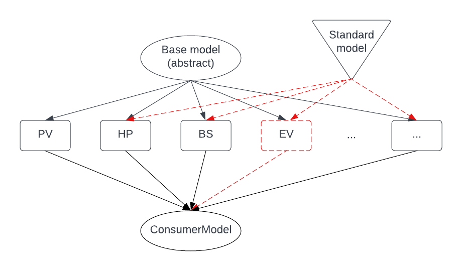

# Welcome to consmodel library 👋


!!! Warning: the library is active and the functionalities are being added on weekly basis, some functionalities will also change !!!

The library aims to provide a simple way to create individual consumer loads and generation. The main idea of the library is to be able to easily create consumption or generation power consumption profiles.

The library is a centralised modelling tool that implements the following consumption/generation consumptions:
   * pure consumption model,
   * solar plant model,
   * heat pump model,
   * electric vehicle modelling,
   * possibly other models...

The main idea of the library is to be able to easily create consumption or generation power consumption profiles.

The schema of the library is as follows:

### 🏠 [Homepage](https://github.com/blazdob/consmodel)

## Install

```sh
pip3 install consmodel
```

## Usage

### PV model
```python
   from consmodel import PV
   import pandas as pd
   import numpy as np
   import matplotlib.pyplot as plt

   # create a simple PV model
   pv = PV(lat=46.155768,
           lon=14.304951,
           alt=400,
           index=1,
           name="test",
           freq="15min",)
   timeseries = pv.simulate(pv_size=14.,
                            year=2022,
                            model="ineichen",
                            consider_cloud_cover=True)
   # plot the results
   timeseries.plot()
   plt.show()
```

### BS model
```python
   from consmodel import BS
   import pandas as pd
   import numpy as np
   import matplotlib.pyplot as plt

   # create a simple PV model
   test_consumption = [0.,-3.,-2.,8.,7.,6.,7.,8.,5.,4.,-2.]
   test_consumption_df = pd.DataFrame({"p": test_consumption},
                  index=pd.date_range("2020-01-01 06:00:00",
                                       periods=11,
                                       freq="15min"))
   bs = BS(lat=46.155768,
           lon=14.304951,
           alt=400,
           index=1,
           st_type="10kWh_5kW",
           freq="15min",)
   timeseries = batt.simulate(control_type="installed_power",
                              p_kw=test_consumption_df)
   # plot the results
   timeseries.plot()
   plt.show()
```


## Author

👤 **Blaž Dobravec**

* Website: https://github.com/blazdob
* Github: [@blazdob](https://github.com/blazdob)
* LinkedIn: [@https:\/\/www.linkedin.com\/in\/blaz-dobravec\/](https://linkedin.com/in/https:\/\/www.linkedin.com\/in\/blaz-dobravec\/)

## Colaborated:

* Matej Oblak: [@MatejGitOblak](https://github.com/MatejGitOblak)
* Bine Flajnik: [@Bine-f](https://github.com/Bine-f)


## 🤝 Contributing

Contributions, issues and feature requests are welcome!

Feel free to check [issues page](https://github.com/blazdob/consmodel/issue).

## Show your support

Give a ⭐️ if this project helped you!

